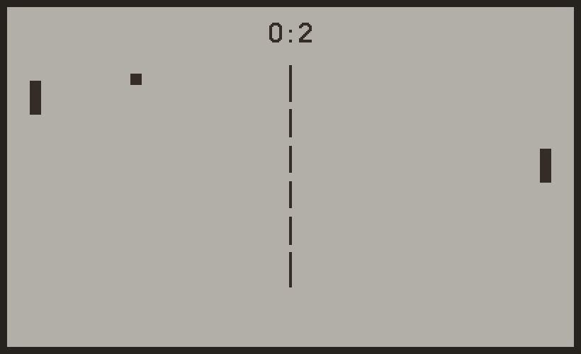
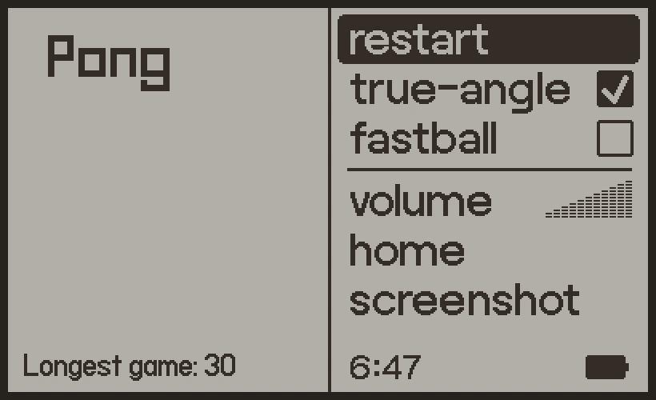
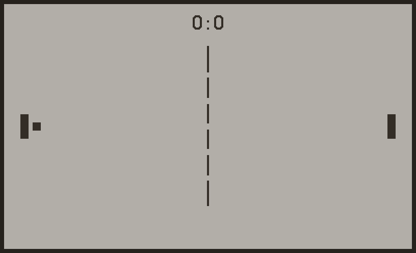

# (bootleg) Pong for Playdate

Features:
- player moves with arrows/crank
- bot: defensive (he is trying to survive)
- records longest game
- fastball: doubles the speed
- true-angle: calculates angle (vs regular 3 angles)

[Download this game](https://rafaelmikayelyan.itch.io/bootleg-pong) on your handheld or [Playdate Simulator](https://play.date).

## ToDo
- change speedball
- improve bot
- add menu animation
